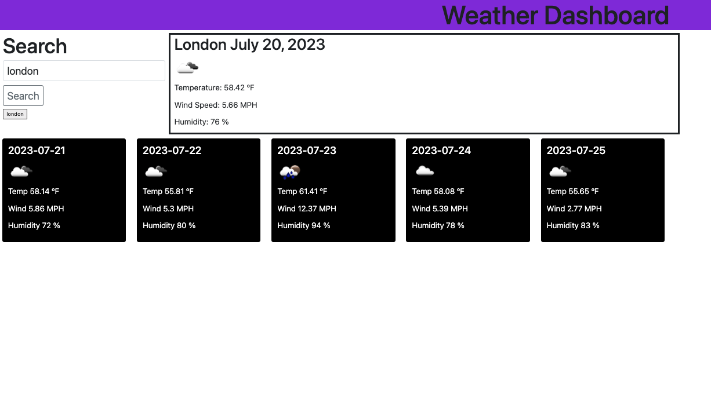

# drawlin22-dashboard-06

Description: This project was to create a weather dashboard using API's. The fuctionality of the site allows a user to input the city name that they want to view the current weather, as well as a five day forecast of upcoming weather. Once a city is searched for the city name is held in local storage and creates a button to allow the user to quickly recheck the weather of previous searches. For each city queried the date, the temperature, wind speed, humidty, as well as an icon representation of the weather conditions is displayed.

Installation:

Link to Deployed website: https://drawlin22.github.io/drawlin22-dashboard-06/

Usage Deployed Site:

Credits:

Ask BCS help : David Gaither, Mia dilberovicm

Peer colaboration: Chelsea Wagner

https://github.com/caf62219/weather-website

License: Please refer to the LICENSE in the repo.